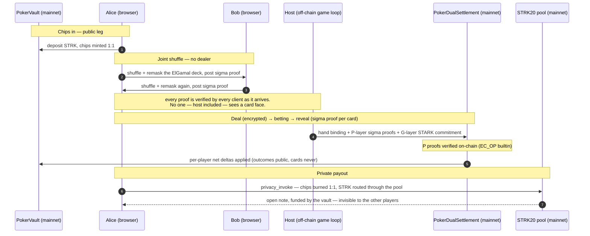

# poker_texas_air — Provably Fair Texas Hold'em where Cheating is Mathematically Impossible

**English** | [简体中文](README.zh-CN.md)

[](https://strk.secretpokers.com/)
[](https://www.youtube.com/watch?v=uqtrvw_bR4w)
[](#mainnet-evidence)


> The only poker with no trusted dealer — cards are encrypted, shuffles are
> proven, settlement is verified on-chain, and the money can't be frozen.

🎮 **[Play the live demo](https://strk.secretpokers.com/)** ·
🎬 **[Watch the 3-minute video](https://www.youtube.com/watch?v=uqtrvw_bR4w)** ·
📜 [strk20.json](strk20.json) — machine-readable deployment manifest

A full-stack, provably fair online Texas Hold'em on Starknet — a poker platform
where the operator is cryptographically incapable of cheating at, or freezing
the money of, the game it hosts. **Live on Starknet mainnet since 2026-09-07**:
5 contracts, the full chips loop (deposit → settle → private claim) already
transacting.

No Ready wallet? The [video](https://www.youtube.com/watch?v=uqtrvw_bR4w) walks
the full mainnet loop in 3 minutes.

<!-- TODO: drop 1–3 product screenshots into docs/assets/ (table view with encrypted
hands, proof-verification panel, settlement tx on Starkscan) and uncomment:
<p align="center">
  
  
</p>
-->

## Highlights

| | |
|---|---|
| **No trusted dealer** | Mental poker: cards are ElGamal-encrypted and shuffled *jointly by the players*; every step carries a sigma proof. The host cannot peek, cannot stack the deck. |
| **Fairness enforced on-chain** | P-layer Stark-curve sigma proofs are verified **on-chain** by `PokerDualSettlement` (EC_OP builtin) — settlement doesn't ask for trust, it checks. |
| **Private, unfreezable chips** | Canonical STRK 1:1 through the official STRK20 privacy pool; payouts arrive as open notes no one can attribute — or block. |
| **Machine-checked protocol** | Formalized in Lean 4: the machine found a soundness flaw in reconstruction V2 that every test suite missed; V3 ships with completeness + soundness theorems. |
| **Web2-speed play** | A hand's total cryptographic work is ~0.1 s class (measured); STARK proving runs asynchronously (15–17 s/hand) and never blocks a bet. |
| **Open for business** | Platform operation, white-label stack, protocol licensing — and open to investment. [Business & contact](#business--contact). |

## What's private vs what's public

Three layers, stated narrowly enough that you can falsify each one on Starkscan:

| Layer | Hidden | Public by design |
|---|---|---|
| **Cards & table state** (mental poker) | Hole-card faces, shuffle order, who holds what — invisible to opponents **and** to the host | Community cards, betting actions (hashed into the on-chain action log), hand outcomes |
| **Money** (STRK20 pool) | Pool-internal flows, note ownership, who claimed what | Deposit/withdraw edges, timing, vault chip balances |
| **Fairness** | *Nothing — deliberately.* Cards are the only secret; the proofs that police them are all public. | Every shuffle/remask/reveal step carries a sigma proof; settlement proofs are verifiable by anyone |

Competing privacy apps hide the money and leave the game public, or hide single
moves behind commit-reveal. Here the game state itself is encrypted end to end —
and the fairness proofs are *more* public than in a conventional poker app, not less.

## How a hand works



## Performance: fairness without the waiting

Trustless designs usually die on latency. This stack was built the hard way to
avoid that: the G-layer trace is a **hand-written AIR library** running on the
**Stwo circle-STARK** prover — no generic circuit DSL, no prover service in the
loop — so the cryptography stays off the player's interaction path.

| What | Measured | Where |
|---|---|---|
| 52-card ZK shuffle — prove + verify | **~67 ms** (release) | [docs/PERFORMANCE.md](docs/PERFORMANCE.md) |
| 9-player full-residual folding (per hand) | **~2 ms** | [docs/PERFORMANCE.md](docs/PERFORMANCE.md) |
| 52-card batch ElGamal deal encryption | **~6 ms** | [docs/PERFORMANCE.md](docs/PERFORMANCE.md) |
| Poseidon challenge derivation | **8 µs/op** | [docs/PERFORMANCE.md](docs/PERFORMANCE.md) |
| Settlement STWO prove (`settle_hand`) | ~2 s/hand, async (`spawn_blocking`) | `texas/src/starknet/hooks.rs` |
| Recursive proving pipeline (production) | **15–17 s/hand** incl. per-prove Cairo compile — fully async, play never waits | `texas/src/starknet/recursion_prover.rs` |

Adding it up: the complete cryptographic work of a hand — shuffle proof, deal
encryption, reveals, fold verification — is **~0.1 s class, measured**. From
first bet to showdown a hand plays out in under a second of visible latency:
a table experience indistinguishable from a conventional Web2 poker app, while
being provably fair. The expensive part (STARK proving) is deliberately off the
interaction path. Among comparable no-trusted-dealer implementations, this is —
to our knowledge — the fastest full loop. GPU acceleration for hand-prove is
the next milestone: a theoretical analysis today, targeting second-level
proofs — see [Roadmap](#roadmap).

## Status

| Capability | Status |
|---|---|
| STRK20 chips loop (deposit → shielded flow → private claim) | ✅ **Live on mainnet** — see [Mainnet evidence](#mainnet-evidence) |
| P-layer settlement proofs (Stark-curve sigma) | ✅ **Verified on-chain** — `PokerDualSettlement`, EC_OP builtin (`dual::hand_batch_stark`) |
| Mental poker shuffle/remask/reveal proofs | ✅ Verified by every client as proofs arrive |
| G-layer STARK batches (Stwo circle-STARK) | 🟡 Host-generated; **anyone can re-verify** — in the browser (`client-wasm`) or locally (`proving-tool`) |
| On-chain G-STARK verifier | 🟠 Phase 2 — see [Roadmap](#roadmap) |
| Lean 4 formalization of reconstruction (V3) | ✅ Machine-checked completeness + soundness theorems in-repo |

**The host is an availability dependency, not a correctness dependency.**
No independent prover service is deployed: the operator generates G-layer proofs
locally with the recursive proving pipeline (≈ 15–17 s per hand, online-measured,
fully asynchronous) and attests to them. But correctness never rests on that
attestation — any player can download the proof bundle and verify it in the
browser or with the Rust verifier, and the P layer settles on-chain regardless.
This is a deliberately staged posture: the on-chain STARK verifier is the
explicit Phase 2 milestone, and until it lands, correctness is *checkable by
anyone* rather than enforced by the chain.

## Why trustless

Every other approach to fair online poker buys fairness with a trusted party:

| Approach | Trusted party | Cards hidden from | The catch |
|---|---|---|---|
| Dealer + STARK attestation | Dealer (posts STARK proofs of honest dealing) | players | the dealer still sees every card |
| Commit-reveal per move | none, but only one move is ever hidden | opponent, one step at a time | no multiparty fairness; the "deck" is a sequence of reveals |
| Mental poker with a dealer | Dealer | players | dealer sees everything |
| **This repo — joint mental poker** | **no one** | opponents, the host, everyone until reveal | the protocol work — done once, here |

Here the deck is ElGamal-encrypted and shuffled *jointly by the players*: each
shuffle/remask/leave/reveal step carries a sigma proof that every other client
verifies as it arrives, and the P layer is re-verified on-chain at settlement.
A host cannot peek, cannot stack the deck, and cannot fake a settlement — the
first two are excluded by the proofs, the third by the EC_OP verifier.

### The Lean 4 catch

The reconstruction protocol was formalized in Lean 4 + Mathlib — and the machine
found what the test suites had not:

| The failure | The rule we now ship by |
|---|---|
| Reconstruction **V2 was unsound**: a machine-checked counterexample showed removed/folded seats leaking card slots to anyone replaying the reconstruction. Found by Lean, not by fuzzing. | No protocol revision ships without machine-checked completeness **and** soundness theorems. V3 carries both ([SECURITY_RECONSTRUCTION.md](poker_protocol_lean/SECURITY_RECONSTRUCTION.md)). |

That is what "proven fair by construction" means in practice: not a slogan, but
a theorem, a counterexample, and a rule that outlived both.

## Why STRK20

A fair game needs fair money. Provable dealing would be worth little if the
money rails could still freeze a winner.

- **Censorship resistance.** Online poker's second-oldest problem after cheating
  is that winners get punished: operator balances freeze, payment processors
  deplatform, winning accounts get quietly restricted. Chips settled through the
  STRK20 privacy pool can't be frozen by us, a bank, or any intermediary — a
  payout is a pool note, not a promise.
- **Fungibility.** Pool-internal flows are un-attributable: a big winner's
  payout doesn't carry a target on its back. (Deposit/withdraw edges and timing
  are public — stated in [What's private](#whats-private-vs-whats-public);
  attribution inside the pool is not.)
- **Self-custody by default.** Chips live in the vault contract, not on our
  balance sheet, and `unlock_after_deadline` (permissionless, 12 h TTL) is an
  exit that works even if we disappear.
- **Symmetry.** We spent enormous effort — in `poker_protocol`'s design,
  formal verification and optimization — making the *game* fair. Settling a
  provably fair game over money that can be frozen or discriminated would
  finish only half the job. STRK20 completes it: fair cards **and** fair money.
- **Canonical STRK, no wrapped token.** Chips are the asset itself (1 chip =
  10¹⁵ wei), anchored 1:1 in the vault. There is no project-issued token whose
  failure mode would be ours.

## STRK20 integration

| Leg | What happens | Contract |
|---|---|---|
| 1 · Chips in | Player deposits STRK; chips minted 1:1 | `PokerVault` |
| 2 · Private buy-in | `privacy_invoke` through the official STRK20 pool; chips credited without exposing table-side flows | `PokerVaultAnonymizer` |
| 3 · Settlement | Dual-proof settlement (P on-chain, G committed); SNIP-36 recursive batch proofs with legacy fallback | `PokerDualSettlement` / `PokerSettlement` |
| 4 · Private payout | Chips burned 1:1; the vault funds an **open note** in the STRK20 pool — provable to the winner, opaque to everyone else | `SettlementPayoutAnonymizer` |

The pool (`0x040337b1…812a`) is the official STRK20 privacy pool — an external
dependency bound in both anonymizer constructors, not deployed by us. Full wiring,
class hashes, and read-back checks: [strk20.json](strk20.json),
[poker_contracts/DEPLOYMENTS.md](poker_contracts/DEPLOYMENTS.md).

## Mainnet evidence

Deployed 2026-09-07 via `poker_contracts/scripts/deploy_mainnet.sh`
(total cost 122.37 STRK vs 115.5 estimated). Every wiring claim below was verified
by on-chain read-back after deployment.

| Contract | Address | Class hash |
|---|---|---|
| `PokerVault` | [`0x3f4ef706…cbb45`](https://starkscan.co/contract/0x3f4ef706ae2dc00ac685afffc05e5f1e1e9ab5aacf99c3205d2067e061cbb45) | `0x7c74ca1a…aaf6e` |
| `PokerSettlement` (legacy fallback) | [`0x2bf6a09c…ee7a8`](https://starkscan.co/contract/0x2bf6a09c0aaea154de34745056e7534f58fa0805c12afe18cf22a9bc66ee7a8) | `0x6f2e01a6…10440` |
| `PokerDualSettlement` (v5) | [`0x1d39b80b…aef6d`](https://starkscan.co/contract/0x1d39b80b990038ceeeaf3d39e83cb83031be95c0d0ccca5d18c5faea29aef6d) | `0x047e91d5…84cf8` |
| `PokerVaultAnonymizer` (v4) | [`0x88c1f843…2877`](https://starkscan.co/contract/0x88c1f843588d1498fcd3f780fa7cf86ada18cd416754c77149a8c14e492877) | `0x525646bd…0c81` |
| `SettlementPayoutAnonymizer` | [`0x40237293…b308`](https://starkscan.co/contract/0x402372930ea52cccbafa459169b3dae3d67051ed741e9af7da669a0f1fbb308) | `0x7c11073c…6a79` |
| *STRK20 privacy pool (external)* | [`0x040337b1…812a`](https://starkscan.co/contract/0x040337b1af3c663e86e333bab5a4b28da8d4652a15a69beee2b677776ffe812a) | — |
| *Canonical STRK* | [`0x04718f5a…938d`](https://starkscan.co/contract/0x04718f5a0fc34cc1af16a1cdee98ffb20c31f5cd61d6ab07201858f4287c938d) | — |

**The chips loop, as the explorer tells it** (all 2026-09-07, chronologically; the
same 6 hashes are listed in [strk20.json](strk20.json) `transactions`):

| # | What happened | Tx |
|---|---|---|
| 1 | **The public deposit** — a player wires 1 STRK into `PokerVault`; chips minted 1:1. The deposit edge is public by design; the cards dealt from those chips are not. | [`0x639263f8…dab69`](https://starkscan.co/tx/0x639263f89bccef1bef806409da74962d7e7829043deb153fb0ea2e5ddbdab69) |
| 2 | **Settlement, hand one** — `PokerDualSettlement` verifies the P-layer Stark-curve sigma proofs on-chain (EC_OP builtin) and the vault applies per-player net deltas. Calldata carries commitments, not card faces. | [`0xcd9b13ec…52a4b`](https://starkscan.co/tx/0xcd9b13ececa4649ce5f6e7ad80acf80e1ab03a57190e4035e7240369152a4b) |
| 3 | **Shielding into the pool** — a second wallet approves and moves STRK into the STRK20 privacy pool, holding the value as private notes. The money enters the shielded rail: the explorer sees the pool move, and nothing else about the table. | [`0x00a62a09…1c51c`](https://starkscan.co/tx/0x00a62a09872eb695ec32d9a86300cf4bff5ced8ea87fbb33f879b5389ce1c51c) |
| 4 | **The private claim** — SNIP-36 `privacy_invoke`: chips burned, STRK routed through the STRK20 pool, an open note minted for the winner. The pool moves; the attribution doesn't. | [`0x1daa47a0…e7e04`](https://starkscan.co/tx/0x1daa47a0efde4fad6bbf3d81f88af40ed3951a946b3ece84ac06f6fbb6e7e04) |
| 5 | **Settlement, hand two** — same path as #2. | [`0x7edf5045…358982`](https://starkscan.co/tx/0x7edf5045bcc1aab3f748d503611c8a2c73b15c5cac0224e4dbf4a4801358982) |
| 6 | **Second private claim** — same path as #4, second winner. | [`0x6fe8e61e…79d6cc`](https://starkscan.co/tx/0x6fe8e61e009ad5168c683fb2560c73fba4a92e9eba723455c3557bd6e79d6cc) |

## Trust model & proof policy

[strk20.json](strk20.json) → `proof_policy` states this exactly; summary:

| Layer | Statement | Verified where |
|---|---|---|
| **P (sigma)** | per-player ownership / fold / reveal proofs — Stark-curve sigma, Poseidon challenge | **On-chain** — `PokerDualSettlement` EC_OP builtin |
| **G (STARK)** | canonical table-transition batches (Stwo circle-STARK) | Host today; **browser-verifiable** via `client-wasm` bundles; on-chain verifier in Phase 2 |
| **Shuffle chain** | joint shuffle with sigma proofs per step | Every client, as proofs arrive |

Why an open host-verified prover still beats a closed on-chain contract: what a
proof system buys you decomposes into *execution integrity* and *specification
transparency*. This repo has the same execution-integrity guarantees as any
STARK-proven system (Stwo, no stronger assumptions), plus a reviewable,
hash-bound specification — open AIR, mutation tests that attack the AIR directly,
Lean theorems — where a closed-source contract has none: the chain proves
`output = F(input)` but `F` is unknown, so the residual trust root is the
deployer, permanently. Structurally this is the same trust pattern Starknet
itself presents to Ethereum L1; Phase 2 (on-chain G verifier) makes it fully
isomorphic at the application layer.

Honest boundaries: on-chain G enforcement today is registration (`g_attestation`)
plus digest binding, not direct verification — bounded, browser-verifiable, and
deleted in Phase 2; open source is not correctness, hence the fail-closed
coverage matrix and mutation tests; browser verification depends on the served
wasm bundle, which is why the endgame is the on-chain verifier, where the
verification key and constraints become chain facts. Design details:
[DUAL_PROOF_PROTOCOL.md](docs/design/DUAL_PROOF_PROTOCOL.md),
[SOUNDNESS.md](docs/SOUNDNESS.md).

## Known limitations

1. **G-layer trust root is temporary.** Until Phase 2, the chain registers G
   attestations rather than verifying the proofs directly. Anyone can re-verify
   in the browser; the chain just doesn't enforce it yet.
2. **Host availability.** The game loop runs off-chain; if the host goes down,
   tables stop. Funds are not at risk — chips stay in the vault, and the vault's
   `unlock_after_deadline` (permissionless, 12 h TTL) guarantees exit.
3. **Edge linkability & timing.** Deposit/withdraw edges and their timing are
   public — inherent to pool designs. Pool-internal flows and note ownership are
   not attributable.
4. **Proof economics.** The recursive proving pipeline costs ≈ 15–17 s per hand
   (online-measured, including per-prove Cairo compilation; fully asynchronous —
   play never waits; the standalone bench route is ~24–29 s, see
   [proving-tool](proving-tool/README.md)). GPU acceleration targeting
   second-level proofs is analyzed in the [Roadmap](#roadmap) — no benchmarks yet.
5. **Upgrade posture.** The STRK20 pool address is pinned in the anonymizer
   constructors; a pool upgrade requires helper redeployment.

## Repository guide

This is a large repo (11 workspace crates, ~320 first-party Rust source files
plus the vendored StarkWare proving stack, 25 Cairo contract files, 33 Lean
files). It is organized in five layers, bottom-up:

**Pick a reading path:**

```
I just want to play / watch   → client/ + texas/            (or the live demo)
I want to check the fairness  → poker_protocol*/ + client-wasm/ + poker_protocol_lean/
I want to audit the chain     → poker_contracts/ + docs/design/DUAL_PROOF_PROTOCOL.md
I care about the proving tech → src/ + proving-tool/ + hand-bench/ + docs/PERFORMANCE.md
```

**① Protocol layer — why the game is fair** (pure cryptography, no I/O)

| Directory | Role |
|---|---|
| [`poker_protocol/`](poker_protocol/) | Mental-poker orchestration: ElGamal encryption, joint shuffle, deal / reveal / leave / reconstruct state machine |
| [`poker-protocol-core/`](poker-protocol-core/) | Curve-generic crypto backends — **the Stark curve is the only production world** (Plan D) |
| [`poker-protocol-proofs/`](poker-protocol-proofs/) | Sigma-proof suite: shuffle, remask, leave, reveal, DLEq, unified sigma |
| [`poker-protocol-bg/`](poker-protocol-bg/) | Bayer–Groth shuffle argument (`bg_stark`) |
| [`poker-protocol-abi/`](poker-protocol-abi/) | Byte-stable Rust↔Cairo ABI — single source of truth for curve/transcript/payload encodings |
| [`poker_protocol_lean/`](poker_protocol_lean/) | Lean 4 + Mathlib formalization: the V2 counterexample, the V3 theorems |
| [`fuzz/`](fuzz/) | Protocol fuzz targets (standalone `cargo-fuzz` workspace) |

**② Proving layer — the G-layer STARK, hand-written**

| Directory | Role |
|---|---|
| [`src/`](src/) | Texas AIR: hand-written trace generation + Stwo circle-STARK proving stack (the performance core) |
| [`proving-tool/`](proving-tool/) | `prove-hand` CLI: Cairo1 → cairo-vm → Stwo prove → verify (separate workspace/toolchain) |
| [`poker_contracts/hand-verify-native/`](poker_contracts/hand-verify-native/) | Native P-layer batch verification + the recursive proving route used in production |
| [`hand-bench/`](hand-bench/) | End-to-end proving benchmark for one complete hand |
| [`third_party/proving/`](third_party/proving/) | Vendored starkware-libs/proving (Apache-2.0, with local patches) |

**③ Contract layer — on-chain settlement & private money flow**

| Directory | Role |
|---|---|
| [`poker_contracts/`](poker_contracts/) | Cairo contracts: `PokerVault` (1:1 chips), `PokerVaultAnonymizer` / `SettlementPayoutAnonymizer` (STRK20 pool legs), `PokerSettlement` (legacy fallback), `PokerDualSettlement` (P-layer EC_OP verification via `dual::hand_batch_stark` + SNIP-36 settlement) |

**④ Application layer — the playable product**

| Directory | Role |
|---|---|
| [`texas/`](texas/) | Game server: axum + socket.io game loop, Starknet settlement, and the production recursive proving pipeline (15–17 s/hand, async) |
| [`client/`](client/) | React 18 + Vite web client (Ready Wallet: login, buy-in, STRK20 actions) |
| [`client-wasm/`](client-wasm/) | wasm-bindgen bridge: browser-side crypto & proof verification — the carrier of browser-verifiable STARKs |
| [`payout-sidecar/`](payout-sidecar/) | Payout sidecar: randomized delay jitter + bounded retries, pays winners via private STRK20 notes (payer/payee unlinkable) |
| [`deploy/`](deploy/) · [`scripts/`](scripts/) | systemd/nginx deployment assets; benchmarks & docs ratchets |
| [`vm-common/`](vm-common/) · [`poker_l1/`](poker_l1/) | Texas-poker contract library (VM semantics for proof replay) + shared utils |

**⑤ Docs & manifest**

| Path | Role |
|---|---|
| [`docs/`](docs/) | `docs/design/` — current designs; `docs/archive/` — superseded history |
| [`strk20.json`](strk20.json) | Deployment manifest: contracts, class hashes, transactions, proof policy (machine-readable) |

## Documentation

- [docs/README.md](docs/README.md) — documentation map (current state / design / operations)
- [docs/STATUS.md](docs/STATUS.md) — canonical AIR coverage & trust boundary (authoritative)
- [docs/design/DUAL_PROOF_PROTOCOL.md](docs/design/DUAL_PROOF_PROTOCOL.md) — dual-proof settlement spec (v2.9, live)
- [docs/SOUNDNESS.md](docs/SOUNDNESS.md) — final soundness status (Lean / DAPV / AIR pillars)
- [docs/design/SETTLEMENT_PRIVACY_PLAN.md](docs/design/SETTLEMENT_PRIVACY_PLAN.md) — settlement privacy plan
- [docs/design/TEXAS_TAGGED_AIR.md](docs/design/TEXAS_TAGGED_AIR.md) — direct state-transition AIR paths
- [docs/PERFORMANCE.md](docs/PERFORMANCE.md) — final performance record (baselines, production pipeline, on-chain gas)
- [poker_protocol_lean/SECURITY_RECONSTRUCTION.md](poker_protocol_lean/SECURITY_RECONSTRUCTION.md) — the V2 counterexample and V3 theorems
- [poker_contracts/DEPLOYMENTS.md](poker_contracts/DEPLOYMENTS.md) — full deployment & wiring history (devnet → Sepolia → mainnet)
- [CONTRIBUTING.md](CONTRIBUTING.md) · superseded docs: [docs/archive/](docs/archive/)

## Verify it yourself

- **60 seconds, no wallet:** open the [live demo](https://strk.secretpokers.com/) —
  the client verifies every shuffle/reveal sigma proof as it arrives.
- **Browser STARK verification:** pull the proof bundle of a settled hand and
  verify it with `client-wasm` (no trust in the host's attestation required).
- **CLI:** `proving-tool` proves and verifies a complete hand end-to-end
  (Cairo1 → cairo-vm → Stwo prove → verify) — see
  [proving-tool/README.md](proving-tool/README.md).
- **Rebuild from source:**
  `cargo test --workspace` (Rust stack) · `snforge test` in `poker_contracts`
  (91 contract tests) · `poker_protocol_lean` (Lean 4 theorems) ·
  `cargo test -p poker-protocol-proofs --release --test plan_d_perf -- --ignored`
  (the performance numbers above).
- **On-chain e2e smoke** (real settlement against Sepolia):
  `STARKNET_SEPOLIA_SMOKE=1 cargo test -p texas --bin texas sepolia_settle_smoke -- --ignored --nocapture`
- **Explorer-first:** every mainnet claim in this README links to Starkscan, and
  [strk20.json](strk20.json) is the machine-readable index (contracts, class
  hashes, transactions, proof policy).

## Quick start

Prerequisites: Rust `nightly-2026-04-15` (pinned via rust-toolchain.toml),
[Scarb](https://docs.swmansion.com/scarb/) + snforge (Cairo/Starknet 2.11),
Node.js + pnpm, wasm-pack.

```bash
# 1. Rust workspace (AIR stack + protocol crates + game server)
cargo test --workspace

# 2. Cairo contracts
cd poker_contracts && scarb build && snforge test && cd ..

# 3. Browser crypto/verification WASM
wasm-pack build client-wasm --target web

# 4. Local devnet deployment of Vault/Settlement
./poker_contracts/scripts/local_deploy.sh

# 5. Game server (copy texas/.env.example to texas/.env first)
cargo run -p texas

# 6. Web client
cd client && pnpm install && pnpm dev

# 7. (optional) G-layer STARK proof demo — separate toolchain
cd proving-tool && ./prove-hand.sh
```

The server starts in Starknet dev mode without `STARKNET_RPC_URL` (on-chain
checks auto-pass for local play).

### Deployment

```bash
cd poker_contracts
export SNCAST_ACCOUNT=... SNCAST_URL=... OWNER=... PROVER=... INITIAL_SUPPLY=...
./scripts/deploy_sepolia.sh        # Sepolia: declare + deploy + wire
CONFIRM_MAINNET=yes ./scripts/deploy_mainnet.sh   # mainnet: 5 contracts + wiring + read-back
```

After deploying, backfill addresses/class hashes into [strk20.json](strk20.json)
and [poker_contracts/DEPLOYMENTS.md](poker_contracts/DEPLOYMENTS.md). All
configuration is environment-driven (`texas/.env.example` → `texas/.env`); never
commit private keys or deployer seeds.

## Roadmap

1. **Phase 2** — on-chain G-STARK verifier (Cairo `cairo_verifier`) wired into
   `PokerDualSettlement`; removes host attestation entirely.
2. **Phase 3** — standalone prover service (removes the proving dependency on
   the operator's machine).
3. **GPU-accelerated hand-prove** — *theoretical analysis, no benchmarks yet.*
   The proving workload is dominated by data-parallel operations — circle-STARK
   FRI field arithmetic, batched Poseidon hashing, AIR row evaluation — which
   map naturally onto GPUs. The design target is second-level proofs for the
   recursive pipeline, making it real-time; this is an engineering estimate
   from the operation profile, not a measured result.
4. Real `hand_verify.cairo` circuit (replacing the bench stand-in in `proving-tool`).

## Business & contact

**The product.** An online poker room where *"is the site rigged?"* stops being
a question. Every deal, shuffle and settlement is verifiable by any player in
any browser; the operator is cryptographically excluded from the trust loop.
Trust has been online poker's structural deficit since its inception — provable
fairness turns that deficit into the product itself.

**Why this stack.** Trustless designs usually die on performance; this one plays
at Web2 speed ([measured](#performance-fairness-without-the-waiting)) and
settles privately on mainnet today. The moat compounds across layers: a
trustless mental-poker protocol, an on-chain EC_OP proof verifier, a Lean 4
machine-checked protocol, browser-side STARK verification, and a production
recursive proving pipeline — years of protocol work in `poker_protocol`,
pursued at considerable cost for one reason: fairness you don't have to believe,
only check. That cannot be replicated by re-skinning an open-source casino.

**Directions we're open to**

- Operating and licensing the platform as a fairness-first poker room.
- White-labeling the provably-fair stack — protocol, contracts and proving
  pipeline — to existing operators.
- Protocol licensing and partnerships (`poker_protocol`, `proving-tool`,
  dual-proof settlement).

**We are open to investment.**
Contact: **[linqining1994@gmail.com](mailto:linqining1994@gmail.com)**

## License

Source-available under **[BUSL-1.1](LICENSE)**: free for non-commercial use,
research, education, and hackathon evaluation; commercial use requires a
separate license. Converts to Apache-2.0 on 2029-12-31. Third-party
components (StarkWare proving stack, OpenZeppelin, Rust ecosystem crates)
remain under their own permissive licenses — see
[THIRD_PARTY_NOTICES](LICENSE) in the license text.
