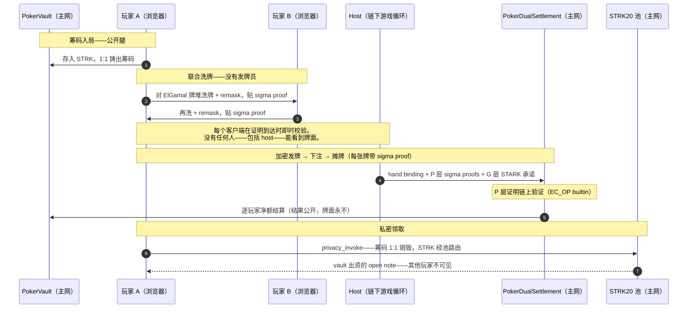

# poker_texas_air — 可证明公平的德州扑克：作弊在数学上不可能

[English](README.md) | **简体中文**

[](https://strk.secretpokers.com/)
[](https://www.youtube.com/watch?v=uqtrvw_bR4w)
[](#主网证据)


> 唯一没有可信发牌员的扑克——牌面加密、洗牌可证明、结算链上验证、资金无法冻结。

🎮 **[在线 demo](https://strk.secretpokers.com/)** ·
🎬 **[3 分钟演示视频](https://www.youtube.com/watch?v=uqtrvw_bR4w)** ·
📜 [strk20.json](strk20.json)——机器可读的部署清单

一个构建在 Starknet 上的全栈可证明公平在线德州扑克——运营方在密码学上无法
对自己运营的牌局作弊、也无法冻结牌局的资金。**2026-09-07 起部署并实际运行于
Starknet 主网**：5 个合约，完整筹码回路（存入 → 结算 → 私密领取）已有真实交易。

没有 Ready 钱包？[视频](https://www.youtube.com/watch?v=uqtrvw_bR4w) 3 分钟走完整条主网回路。

<!-- TODO: 截图 1–3 张放入 docs/assets/（牌桌面密文手牌、证明校验面板、Starkscan 结算交易）后取消注释：
<p align="center">
  
  
</p>
-->

## 亮点速览

| | |
|---|---|
| **无可信发牌员** | Mental poker：牌以 ElGamal 加密、由玩家**联合**洗牌，每步带 sigma proof。host 偷看不了、做不了千术。 |
| **公平性链上强制** | P 层 Stark 曲线 sigma 证明由 `PokerDualSettlement` **链上验证**（EC_OP builtin）——结算不请求信任，只做检查。 |
| **私密、不可冻结的筹码** | canonical STRK 1:1 走官方 STRK20 隐私池；赔付以 open note 到达，无人可归因——也无人可拦截。 |
| **机器检查的协议** | Lean 4 形式化：机器找到了所有测试套件都漏掉的 V2 不健全缺陷；V3 携带完备性 + 健全性定理。 |
| **Web2 速度的对局** | 一手牌全部密码学开销 ~0.1 秒级（实测）；STARK 证明异步运行（15–17 秒/手），从不下注等待。 |
| **开放商业合作** | 平台运营、白牌输出、协议授权——接受投资。见[商业与合作](#商业与合作)。 |

## 什么私密、什么公开

三层拆分，每层都拆到"可以在 Starkscan 上证伪"的粒度：

| 层 | 隐藏 | 设计上公开 |
|---|---|---|
| **牌面与桌面状态**（mental poker） | 底牌牌面、洗牌顺序、谁持什么牌——对手看不到，**host 也看不到** | 公共牌、下注动作（哈希进链上动作日志）、手牌结果 |
| **资金**（STRK20 池） | 池内资金流、note 归属、谁领了多少 | 存入/取出边、时间、vault 筹码余额 |
| **公平性** | *没有——故意的。* 牌是唯一的秘密；约束牌的证明全部公开。 | 每一步洗牌/remask/摊牌都带 sigma proof；结算证明任何人可验证 |

其他隐私应用要么只藏资金流（牌面公开），要么用 commit-reveal 藏单步动作。
本项目把游戏状态本身端到端加密——公平性证明反而比传统扑克**更**公开，而不是更少。

## 一手牌怎么跑



## 性能：公平不必以等待为代价

无信任设计通常死于时延。这套栈是按"笨办法"造的：G 层 trace 是**从零手写的
AIR 库**，跑在 **Stwo circle-STARK** 证明器上——没有通用电路 DSL，也没有
prover 服务插入链路——密码学被彻底移出了玩家的交互路径。

| 项 | 实测 | 出处 |
|---|---|---|
| 52 卡 ZK 洗牌——prove + verify | **~67 ms**（release） | [docs/PERFORMANCE.md](docs/PERFORMANCE.md) |
| 9 人桌全残差折叠（每手） | **~2 ms** | [docs/PERFORMANCE.md](docs/PERFORMANCE.md) |
| 52 卡批量 ElGamal 发牌加密 | **~6 ms** | [docs/PERFORMANCE.md](docs/PERFORMANCE.md) |
| Poseidon 挑战派生 | **8 µs/op** | [docs/PERFORMANCE.md](docs/PERFORMANCE.md) |
| 结算 STWO 证明（`settle_hand`） | ~2 秒/手，异步（`spawn_blocking`） | `texas/src/starknet/hooks.rs` |
| 递归证明流水线（生产） | **15–17 秒/手**（含每次证明的 Cairo 编译）——完全异步，对局零等待 | `texas/src/starknet/recursion_prover.rs` |

加总：一手牌的完整密码学工作——洗牌证明、发牌加密、摊牌、弃牌验证——
合计 **~0.1 秒级（实测）**。从第一次下注到摊牌，一手牌的可见时延不足一秒：
牌桌体验与常规 Web2 扑克应用无异，同时是可证明公平的。昂贵的部分（STARK
证明）被刻意放在交互路径之外。在同类无可信发牌员的实现中，这是据我们所知
最快的完整回路。hand-prove 的 **GPU 加速**是下一个里程碑：目前为理论分析、
尚无实测数据，目标秒级证明——见[Roadmap](#roadmap)。

## 状态表

| 能力 | 状态 |
|---|---|
| STRK20 筹码回路（存入 → 池内流转 → 私密领取） | ✅ **主网已上线**——见[主网证据](#主网证据) |
| P 层结算证明（Stark 曲线 sigma） | ✅ **链上验证**——`PokerDualSettlement`，EC_OP builtin（`dual::hand_batch_stark`） |
| Mental poker 洗牌/remask/摊牌证明 | ✅ 每个客户端在证明到达时即时校验 |
| G 层 STARK 批次（Stwo circle-STARK） | 🟡 host 生成；**任何人可自行重验**——浏览器（`client-wasm`）或本地（`proving-tool`） |
| 链上 G-STARK verifier | 🟠 Phase 2——见[Roadmap](#roadmap) |
| 重建协议 Lean 4 形式化（V3） | ✅ 完备性 + 健全性定理机器检查，入仓 |

**Host 是可用性依赖，不是正确性依赖。** 未部署独立 prover 服务：operator 用
递归证明流水线本地生成 G 层证明（≈ 15–17 秒/手，线上实测，完全异步）并对其
作证。但正确性从不依赖这份作证——任何玩家可下载 proof bundle 在浏览器或用
Rust verifier 重验，且 P 层照常链上结算。这是刻意分阶段的姿态：链上 STARK
verifier 是明确的 Phase 2 里程碑，在它落地之前，正确性是**任何人可自行检查**
的，只是尚不由链强制。

## 为什么无信任

所有其他"公平扑克"方案都在用可信方购买公平：

| 方案 | 可信方 | 牌对谁隐藏 | 代价 |
|---|---|---|---|
| 发牌员 + STARK 作证 | 发牌员（贴 STARK 证明自证发牌诚实） | 玩家 | 发牌员仍然看得到每一张牌 |
| Commit-reveal 逐步 | 无，但每步只藏一步 | 对手，单步 | 没有多方公平；"牌堆"退化为逐步揭示 |
| 可信发牌员 mental poker | 发牌员 | 玩家 | 发牌员看到一切 |
| **本项目——联合 mental poker** | **没有人** | 对手、host、所有人（直到摊牌） | 协议工作量——一次性付清，就在这里 |

牌堆由 ElGamal 加密、由玩家**联合**洗牌：每步 shuffle/remask/leave/reveal 都带
sigma proof，所有其他客户端即时校验；P 层在结算时再经链上重验。host 偷看不了、
做不了千术、也伪造不了结算——前两者被证明排除，第三者被 EC_OP verifier 排除。

### Lean 4 抓虫记

重建协议在 Lean 4 + Mathlib 中形式化——机器找到了所有测试套件都没找到的东西：

| 失败 | 从此遵守的规则 |
|---|---|
| 重建协议 **V2 不健全**：机器检查出反例——被移除/弃牌的座位会向重放重建过程的任何人泄露牌槽。是 Lean 发现的，不是 fuzz。 | 协议任何修订必须带机器检查的完备性**与**健全性定理才能上线。V3 两者兼备（[SECURITY_RECONSTRUCTION.md](poker_protocol_lean/SECURITY_RECONSTRUCTION.md)）。 |

这就是"构造上证明公平"的实操含义：不是口号，是一条定理、一个反例，和一条
比两者都活得久的规则。

## 为什么选 STRK20

公平的牌局需要公平的钱。如果资金轨道仍然能冻结赢家，可证明的发牌价值有限。

- **抗审查。** 在线扑克在"作弊"之后第二个最古老的问题，是赢家会被惩罚：
  运营方余额可冻结、支付渠道可下架、赢钱账户被悄悄限制。经 STRK20 隐私池
  结算的筹码无法被我们、银行或任何中间人冻结——赔付是一张池内 note，
  不是一句承诺。
- **同质化。** 池内资金流不可归因：大赢家的赔付背后不带靶子。（存取边与时序
  公开——已在[什么私密](#什么私密什么公开)声明；池内归因不可得。）
- **默认自托管。** 筹码在 vault 合约里，不在我们的资产负债表上；
  `unlock_after_deadline`（无许可、TTL 12 小时）是一条即使我们消失也有效的
  退出通道。
- **对称性。** 我们在 `poker_protocol` 的设计、形式化验证与优化上投入了巨大
  代价，只为让**牌局**公平。让一场可证明公平的牌局，结算在一种可以被冻结、
  可以被区别对待的钱上，等于只做了一半。STRK20 补齐另一半：牌局公平
  **且**资金公平。
- **Canonical STRK，无包装代币。** 筹码就是资产本身（1 筹码 = 10¹⁵ wei），
  1:1 锚定在 vault。不存在一个"失败模式归我们"的项目方代币。

## STRK20 集成

| 腿 | 动作 | 合约 |
|---|---|---|
| 1 · 筹码入局 | 玩家存入 STRK，1:1 铸出筹码 | `PokerVault` |
| 2 · 私密买入 | 经官方 STRK20 池 `privacy_invoke`；桌面侧资金流不暴露 | `PokerVaultAnonymizer` |
| 3 · 结算 | 双证明结算（P 链上、G 承诺）；SNIP-36 递归批次证明，legacy 兜底 | `PokerDualSettlement` / `PokerSettlement` |
| 4 · 私密领取 | 筹码 1:1 销毁；vault 出资在 STRK20 池铸造 **open note**——赢家可证明，他人不可见 | `SettlementPayoutAnonymizer` |

池地址（`0x040337b1…812a`）是官方 STRK20 隐私池——外部依赖，构造期绑入两个
anonymizer，非本项目部署。接线、class hash 与链上回读记录见
[strk20.json](strk20.json)、[poker_contracts/DEPLOYMENTS.md](poker_contracts/DEPLOYMENTS.md)。

## 主网证据

2026-09-07 经 `poker_contracts/scripts/deploy_mainnet.sh` 部署
（总花费 122.37 STRK，估算 115.5）。以下接线声明均经部署后链上回读验证。

| 合约 | 地址 | Class hash |
|---|---|---|
| `PokerVault` | [`0x3f4ef706…cbb45`](https://starkscan.co/contract/0x3f4ef706ae2dc00ac685afffc05e5f1e1e9ab5aacf99c3205d2067e061cbb45) | `0x7c74ca1a…aaf6e` |
| `PokerSettlement`（legacy 兜底） | [`0x2bf6a09c…ee7a8`](https://starkscan.co/contract/0x2bf6a09c0aaea154de34745056e7534f58fa0805c12afe18cf22a9bc66ee7a8) | `0x6f2e01a6…10440` |
| `PokerDualSettlement`（v5） | [`0x1d39b80b…aef6d`](https://starkscan.co/contract/0x1d39b80b990038ceeeaf3d39e83cb83031be95c0d0ccca5d18c5faea29aef6d) | `0x047e91d5…84cf8` |
| `PokerVaultAnonymizer`（v4） | [`0x88c1f843…2877`](https://starkscan.co/contract/0x88c1f843588d1498fcd3f780fa7cf86ada18cd416754c77149a8c14e492877) | `0x525646bd…0c81` |
| `SettlementPayoutAnonymizer` | [`0x40237293…b308`](https://starkscan.co/contract/0x402372930ea52cccbafa459169b3dae3d67051ed741e9af7da669a0f1fbb308) | `0x7c11073c…6a79` |
| *STRK20 隐私池（外部）* | [`0x040337b1…812a`](https://starkscan.co/contract/0x040337b1af3c663e86e333bab5a4b28da8d4652a15a69beee2b677776ffe812a) | — |
| *Canonical STRK* | [`0x04718f5a…938d`](https://starkscan.co/contract/0x04718f5a0fc34cc1af16a1cdee98ffb20c31f5cd61d6ab07201858f4287c938d) | — |

**筹码回路，用区块浏览器的话讲**（均为 2026-09-07，按时间排序；同 6 个 hash
已列入 [strk20.json](strk20.json) `transactions`）：

| # | 发生了什么 | 交易 |
|---|---|---|
| 1 | **公开存入**——玩家向 `PokerVault` 转入 1 STRK，1:1 铸出筹码。存入边设计上公开；用这些筹码发出的牌不是。 | [`0x639263f8…dab69`](https://starkscan.co/tx/0x639263f89bccef1bef806409da74962d7e7829043deb153fb0ea2e5ddbdab69) |
| 2 | **第一手结算**——`PokerDualSettlement` 链上验证 P 层 Stark 曲线 sigma 证明（EC_OP builtin），vault 逐玩家净额结算。calldata 只有承诺，没有牌面。 | [`0xcd9b13ec…52a4b`](https://starkscan.co/tx/0xcd9b13ececa4649ce5f6e7ad80acf80e1ab03a57190e4035e7240369152a4b) |
| 3 | **shield 入池**——第二个钱包 approve 并将 STRK 送入 STRK20 隐私池、持有为私密 note。资金进入遮蔽轨道：浏览器看得到池动了，看不到牌桌的任何事。 | [`0x00a62a09…1c51c`](https://starkscan.co/tx/0x00a62a09872eb695ec32d9a86300cf4bff5ced8ea87fbb33f879b5389ce1c51c) |
| 4 | **私密领取**——SNIP-36 `privacy_invoke`：筹码销毁、STRK 经 STRK20 池路由、为赢家铸造 open note。池动了，归因没有。 | [`0x1daa47a0…e7e04`](https://starkscan.co/tx/0x1daa47a0efde4fad6bbf3d81f88af40ed3951a946b3ece84ac06f6fbb6e7e04) |
| 5 | **第二手结算**——同 #2。 | [`0x7edf5045…358982`](https://starkscan.co/tx/0x7edf5045bcc1aab3f748d503611c8a2c73b15c5cac0224e4dbf4a4801358982) |
| 6 | **第二次私密领取**——同 #4，第二位赢家。 | [`0x6fe8e61e…79d6cc`](https://starkscan.co/tx/0x6fe8e61e009ad5168c683fb2560c73fba4a92e9eba723455c3557bd6e79d6cc) |

## 信任模型与证明策略

[strk20.json](strk20.json) → `proof_policy` 为准；摘要：

| 层 | 陈述 | 在哪验证 |
|---|---|---|
| **P（sigma）** | 逐玩家 ownership / fold / reveal 证明——Stark 曲线 sigma，Poseidon 挑战 | **链上**——`PokerDualSettlement` EC_OP builtin |
| **G（STARK）** | 规范化桌面状态转移批次（Stwo circle-STARK） | 今日 host；`client-wasm` 证明包**浏览器可验**；链上 verifier 在 Phase 2 |
| **洗牌链** | 联合洗牌，每步 sigma proof | 每个客户端，证明到达即验 |

为什么"开放的 host 验证 prover"仍胜过"封闭的链上合约"：证明系统买到的信任可
分解为*执行完整性*与*规格透明性*。本仓库的执行完整性与任何 STARK 系统同级
（Stwo，无更强假设），另有可审查、哈希绑定的规格——开放 AIR、直接攻击 AIR 的
mutation 测试、Lean 定理；而闭源合约两者皆无：链证明 `output = F(input)` 但
`F` 未知，剩余信任根是部署者本人，且永远如此。结构上这正是 Starknet 自身向
Ethereum L1 呈现的信任模式；Phase 2（链上 G verifier）落地后即完全同构。
设计细节：[DUAL_PROOF_PROTOCOL.md](docs/design/DUAL_PROOF_PROTOCOL.md)、
[SOUNDNESS.md](docs/SOUNDNESS.md)。

诚实边界：链上 G 层强制今日为注册（`g_attestation`）+ 摘要绑定，非直接验证
——有界、浏览器可验、Phase 2 删除；开源不等于正确，故有 fail-closed 覆盖
矩阵与 mutation 测试；浏览器验证依赖所服务的 wasm 包，所以终局是链上
verifier——让验证密钥与约束成为链上事实。

## 已知局限

1. **G 层信任根是临时的。** Phase 2 之前，链上只注册 G 作证而不直接验证证明。
   任何人可浏览器重验，只是链上尚不强制。
2. **Host 可用性。** 游戏循环在链下；host 宕机则牌桌停摆。资金无风险——筹码
   留在 vault，`unlock_after_deadline`（无许可、TTL 12 小时）保证退出通道。
3. **边可关联性与时序。** 存入/取出边及其时间是公开的——池类设计的固有属性。
   池内资金流与 note 归属不可归因。
4. **证明经济学。** 递归证明流水线 ≈ 15–17 秒/手（线上实测，含每次证明的
   Cairo 编译；完全异步——对局从不等待；独立 bench 路线 ~24–29 秒，见
   [proving-tool](proving-tool/README.md)）。GPU 加速指向秒级证明，分析见
   [Roadmap](#roadmap)——暂无实测数据。
5. **升级姿态。** STRK20 池地址在 anonymizer 构造器中写死；池升级需要重部署
   helper。

## 仓库导览

这是一个大仓库（11 个 workspace crate、约 320 个一方 Rust 源文件，另有
vendored 的 StarkWare proving 栈、25 个 Cairo 合约文件、33 个 Lean 文件）。
自底向上分五层组织：

**先选一条阅读路径：**

```
只想玩/看产品            → client/ + texas/               （或直接上在线 demo）
想检查牌局是否公平        → poker_protocol*/ + client-wasm/ + poker_protocol_lean/
想审计链上结算            → poker_contracts/ + docs/design/DUAL_PROOF_PROTOCOL.md
关心证明技术/性能         → src/ + proving-tool/ + hand-bench/ + docs/PERFORMANCE.md
```

**① 协议层——牌局为什么公平**（纯密码学，无 I/O）

| 目录 | 职责 |
|---|---|
| [`poker_protocol/`](poker_protocol/) | Mental-poker 编排：ElGamal 加密、联合洗牌、发牌 / 摊牌 / 离开 / 重建状态机 |
| [`poker-protocol-core/`](poker-protocol-core/) | 曲线泛型密码后端——**Stark 曲线是唯一生产世界**（Plan D） |
| [`poker-protocol-proofs/`](poker-protocol-proofs/) | Sigma 证明套件：shuffle、remask、leave、reveal、DLEq、unified sigma |
| [`poker-protocol-bg/`](poker-protocol-bg/) | Bayer–Groth 洗牌论证（`bg_stark`） |
| [`poker-protocol-abi/`](poker-protocol-abi/) | 字节级稳定的 Rust↔Cairo ABI——curve/transcript/payload 编码的单一事实源 |
| [`poker_protocol_lean/`](poker_protocol_lean/) | Lean 4 + Mathlib 形式化：V2 反例、V3 定理 |
| [`fuzz/`](fuzz/) | 协议 fuzz targets（独立 `cargo-fuzz` 工作区） |

**② 证明层——G 层 STARK，从零手写**

| 目录 | 职责 |
|---|---|
| [`src/`](src/) | Texas AIR：手写 trace 生成 + Stwo circle-STARK 证明栈（性能核心） |
| [`proving-tool/`](proving-tool/) | `prove-hand` CLI：Cairo1 → cairo-vm → Stwo prove → verify（独立工作区/工具链） |
| [`poker_contracts/hand-verify-native/`](poker_contracts/hand-verify-native/) | P 层批量原生验证 + 生产在用的递归证明路线 |
| [`hand-bench/`](hand-bench/) | 一手完整手牌的端到端证明基准 |
| [`third_party/proving/`](third_party/proving/) | Vendored starkware-libs/proving（Apache-2.0，含本地补丁） |

**③ 合约层——链上结算与隐私资金流**

| 目录 | 职责 |
|---|---|
| [`poker_contracts/`](poker_contracts/) | Cairo 合约：`PokerVault`（1:1 筹码）、`PokerVaultAnonymizer` / `SettlementPayoutAnonymizer`（STRK20 池两腿）、`PokerSettlement`（legacy 兜底）、`PokerDualSettlement`（经 `dual::hand_batch_stark` 做 P 层 EC_OP 验证 + SNIP-36 结算） |

**④ 应用层——可玩的产品**

| 目录 | 职责 |
|---|---|
| [`texas/`](texas/) | 游戏服务：axum + socket.io 对局循环、Starknet 结算、生产递归证明流水线（15–17 秒/手，异步） |
| [`client/`](client/) | React 18 + Vite 前端（Ready Wallet：登录、买入、STRK20 动作） |
| [`client-wasm/`](client-wasm/) | wasm-bindgen 桥：浏览器侧加密与证明验证——浏览器可验 STARK 的载体 |
| [`payout-sidecar/`](payout-sidecar/) | 赔付 sidecar：随机延迟抖动 + 有界重试，以私密 STRK20 note 向赢家付款（付款人/收款人不可关联） |
| [`deploy/`](deploy/) · [`scripts/`](scripts/) | systemd/nginx 部署资产；基准与文档 ratchet 脚本 |
| [`vm-common/`](vm-common/) · [`poker_l1/`](poker_l1/) | 德州合约库（证明重放 VM 语义）+ 共享工具 |

**⑤ 文档与清单**

| 路径 | 职责 |
|---|---|
| [`docs/`](docs/) | `docs/design/`——现行设计；`docs/archive/`——已替代的历史 |
| [`strk20.json`](strk20.json) | 部署清单：合约、class hash、交易、证明策略（机器可读） |

## 文档

- [docs/README.md](docs/README.md)——文档地图（现状 / 设计 / 运维）
- [docs/STATUS.md](docs/STATUS.md)——canonical AIR 覆盖与信任边界（权威）
- [docs/design/DUAL_PROOF_PROTOCOL.md](docs/design/DUAL_PROOF_PROTOCOL.md)——双证明结算规格（v2.9，现行）
- [docs/SOUNDNESS.md](docs/SOUNDNESS.md)——健全性最终状态（Lean / DAPV / AIR 三支柱）
- [docs/design/SETTLEMENT_PRIVACY_PLAN.md](docs/design/SETTLEMENT_PRIVACY_PLAN.md)——结算隐私方案
- [docs/design/TEXAS_TAGGED_AIR.md](docs/design/TEXAS_TAGGED_AIR.md)——直接状态转移 AIR 路径
- [docs/PERFORMANCE.md](docs/PERFORMANCE.md)——性能最终记录（基线、生产流水线、链上 gas、GPU 理论分析）
- [poker_protocol_lean/SECURITY_RECONSTRUCTION.md](poker_protocol_lean/SECURITY_RECONSTRUCTION.md)——V2 反例与 V3 定理
- [poker_contracts/DEPLOYMENTS.md](poker_contracts/DEPLOYMENTS.md)——完整部署与接线史（devnet → Sepolia → 主网）
- [CONTRIBUTING.md](CONTRIBUTING.md) · 已过时文档：[docs/archive/](docs/archive/)

## 自己验证

- **60 秒、免钱包**：打开[在线 demo](https://strk.secretpokers.com/)——客户端
  对每个到达的洗牌/摊牌 sigma proof 即时校验。
- **浏览器 STARK 验证**：取一手已结算手牌的 proof bundle，用 `client-wasm`
  验证——不需要信任 host 的作证。
- **CLI**：`proving-tool` 端到端证明并验证完整一手（Cairo1 → cairo-vm →
  Stwo prove → verify）——见 [proving-tool/README.md](proving-tool/README.md)。
- **源码重建**：`cargo test --workspace`（Rust 栈）· `poker_contracts` 内
  `snforge test`（91 个合约测试）· `poker_protocol_lean`（Lean 4 定理）·
  `cargo test -p poker-protocol-proofs --release --test plan_d_perf -- --ignored`
  （上表性能数字）。
- **链上 e2e 冒烟**（对 Sepolia 真实结算）：
  `STARKNET_SEPOLIA_SMOKE=1 cargo test -p texas --bin texas sepolia_settle_smoke -- --ignored --nocapture`
- **浏览器优先**：本 README 每条主网主张都链到 Starkscan；
  [strk20.json](strk20.json) 是机器可读索引（合约、class hash、交易、证明策略）。

## 快速开始

前置：Rust `nightly-2026-04-15`（rust-toolchain.toml 锁定）、
[Scarb](https://docs.swmansion.com/scarb/) + snforge（Cairo/Starknet 2.11）、
Node.js + pnpm、wasm-pack。

```bash
# 1. Rust 工作区（AIR 栈 + 协议 crate + 游戏服务）
cargo test --workspace

# 2. Cairo 合约
cd poker_contracts && scarb build && snforge test && cd ..

# 3. 浏览器加密/验证 WASM
wasm-pack build client-wasm --target web

# 4. 本地 devnet 部署 Vault/Settlement
./poker_contracts/scripts/local_deploy.sh

# 5. 游戏服务（先拷贝 texas/.env.example 为 texas/.env）
cargo run -p texas

# 6. Web 客户端
cd client && pnpm install && pnpm dev

# 7. （可选）G 层 STARK 证明演示——独立工具链
cd proving-tool && ./prove-hand.sh
```

不带 `STARKNET_RPC_URL` 时服务器以 Starknet dev 模式启动（本地对局自动通过
链上检查）。

### 部署

```bash
cd poker_contracts
export SNCAST_ACCOUNT=... SNCAST_URL=... OWNER=... PROVER=... INITIAL_SUPPLY=...
./scripts/deploy_sepolia.sh        # Sepolia：declare + deploy + 接线
CONFIRM_MAINNET=yes ./scripts/deploy_mainnet.sh   # 主网：5 合约 + 接线 + 链上回读
```

部署后回填 [strk20.json](strk20.json) 与
[poker_contracts/DEPLOYMENTS.md](poker_contracts/DEPLOYMENTS.md)。
全部配置走环境变量（`texas/.env.example` → `texas/.env`）；绝不提交私钥或
deployer 种子。

## Roadmap

1. **Phase 2**——链上 G-STARK verifier（Cairo `cairo_verifier`）接入
   `PokerDualSettlement`；彻底移除 host 作证。
2. **Phase 3**——独立 prover 服务（移除证明对 operator 机器的依赖）。
3. **hand-prove 的 GPU 加速**——*理论分析，暂无实测数据。* 证明负载由数据并行
   操作主导——circle-STARK FRI 域运算、批量 Poseidon 哈希、AIR 行求值——天然
   适合 GPU 映射。设计目标：递归流水线达到秒级证明、走向实时；这是基于运算
   剖面的工程估算，不是实测结论。
4. 真 `hand_verify.cairo` 电路（替换 `proving-tool` 中的 bench 替身）。

## 商业与合作

**产品。** 一间"庄家是否出千"不再是问题的在线扑克室。每一次发牌、洗牌、结算
都可由任何玩家在任何浏览器中验证；运营方被密码学性地排除在信任循环之外。
信任是在线扑克与生俱来的结构性赤字——可证明公平把这份赤字变成了产品本身。

**为什么是这套栈。** 无信任设计通常死于性能；这套栈以 Web2 速度对局
（[实测](#性能公平不必以等待为代价)），并已在主网上私密结算。护城河逐层
复合：无可信发牌员的 mental poker 协议、链上 EC_OP 证明验证器、Lean 4 机器
检查的协议、浏览器侧 STARK 验证、生产递归证明流水线——`poker_protocol` 上
数年的协议工作，为一个理由付出了相当大的代价：**不需要相信、只需要检查**
的公平。这无法靠换皮一个开源赌场来复制。

**开放的合作方向**

- 以"公平优先"扑克室运营并授权平台。
- 向既有运营商白牌输出可证明公平技术栈——协议、合约与证明流水线。
- 协议授权与合作（`poker_protocol`、`proving-tool`、双证明结算）。

**本项目接受投资。**
联系：**[linqining1994@gmail.com](mailto:linqining1994@gmail.com)**

## 许可证

**[BUSL-1.1](LICENSE)** 源码可用：非商业使用、研究、教育与黑客松评审免费；
商业使用需另行授权。2029-12-31 起转为 Apache-2.0。第三方组件
（StarkWare proving stack、OpenZeppelin、Rust 生态 crate）仍遵循其自身宽松
许可——见许可文本中的 [THIRD_PARTY_NOTICES](LICENSE)。
