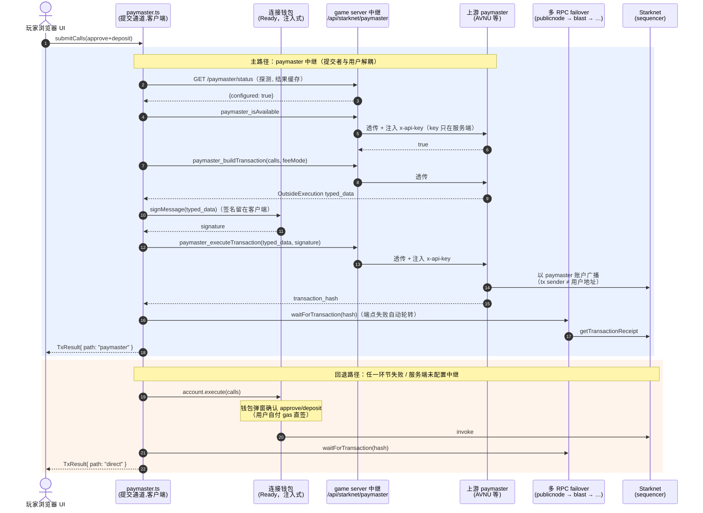

# Plan C：执行层加固 —— 交互示意与实现说明

> 目标：链下执行（提交/中继环节）无法按用户身份定向审查。
> 手段：① 交易经 paymaster 中继提交，链上交易发送者与用户地址解耦；
> ② 多 RPC 提交/读取入口，单端点拒绝不影响可用性；
> ③ session policy 维持最小白名单（approve / deposit / withdraw / 结算查询）。
>
> Plan C 不隐藏交易内容本身（金额、与 PokerVault 的交互在链上仍可见）。
> 资金链路隐私（谁出的钱）需叠加方案 A（池 + burner）或方案 B
> （PokerVault Anonymizer），见前序调研结论。

## 交互示意图（mermaid）



### ASCII 版（环境不渲染 mermaid 时用）

```
                 ┌────────────────────────────────────────────────────────┐
                 │                    玩家浏览器（客户端）                  │
                 │                                                        │
   buy-in ──────▶│ paymaster.ts  submitCalls([approve, deposit])          │
                 │   │                                                    │
                 │   │ ①探测 ②build ③签名(留在客户端) ④execute             │
                 └───┼────────────────────────┬───────────────────────────┘
                     │ JSON-RPC (paymaster_*) │ tx hash
                     ▼                        │
        ┌────────────────────────┐            │
        │ game server 中继        │            │
        │ /api/starknet/paymaster│            │
        │  · 方法白名单 paymaster_│            │
        │  · 注入 x-api-key ─────┼──▶ 上游 paymaster(AVNU)
        │  · 未配置 → 503         │        以 paymaster 账户提交
        └────────────────────────┘        (链上 sender ≠ 用户地址)
                                                │
                                                ▼
   回退(失败/未配置):                        Starknet
   连接钱包(Ready)直签 ───────────────────▶ sequencer
   (钱包弹窗确认,用户自付 gas)
                                                ▲
   回执等待 / 读请求:                           │
   FailoverProvider(publicnode → blast → …) ────┘   单端点失败熔断 30s 自动轮转
```

## 组件与文件

| 位置 | 职责 |
|---|---|
| `texas/src/starknet/paymaster.rs` | 服务端中继：`paymaster_*` JSON-RPC 透传 + `x-api-key` 注入；`GET /status` 能力探测；未配置返回 503（客户端自动回退） |
| `client/src/starknet/paymaster.ts` | 提交通道 `submitCalls()`：中继优先（build → 签名 → execute），失败回退 `account.execute`；状态探测缓存 |
| `client/src/starknet/rpc.ts` | 多 RPC failover provider：异步调用失败熔断 30s 并轮转下一端点 |
| `client/src/starknet/config.ts` | `VITE_STARKNET_RPC_URLS` / paymaster 前端配置 |
| `client/src/starknet/starknetGameActions.ts` | deposit / withdraw / approve 全部改走 `submitCalls()`；approve+deposit 合并为单笔提交 |
| `client/src/starknet/cartridge.ts` | Cartridge 已整体移除（2026-09-04 物理删除，连同 starknetkit；见 TODO C5），approve/deposit 调用面白名单由 paymaster 中继策略承担 |

服务端路由（`texas/src/main.rs`）：

- `POST /api/starknet/paymaster` —— 中继（只放行 `paymaster_` 前缀方法）
- `GET  /api/starknet/paymaster/status` —— `{configured: bool}`

## 配置

服务端（`texas`，见 `.env.example`）：

| 变量 | 说明 |
|---|---|
| `STARKNET_PAYMASTER_URL` | 上游 paymaster JSON-RPC 端点（如 AVNU）。留空 = 中继禁用，全部客户端走直签 |
| `STARKNET_PAYMASTER_API_KEY` | 上游 API key，仅服务端持有，经 `x-api-key` 注入 |

前端（`client`）：

| 变量 | 默认 | 说明 |
|---|---|---|
| `VITE_STARKNET_RPC_URLS` | 链内置公共端点 | 逗号分隔，按优先级 failover |
| `VITE_STARKNET_RPC_URL` | publicnode | 兼容旧配置：作为首选端点 + 内置备选 |
| `VITE_PAYMASTER_DISABLED` | `false` | `true` = 强制全部直签（紧急开关） |
| `VITE_PAYMASTER_FEE_MODE` | `sponsored` | `sponsored` 平台代付 / `default` 用户以 gasToken 付 |
| `VITE_PAYMASTER_GAS_TOKEN` | 空 | `default` 模式下的 ERC-20 地址 |
| `VITE_PAYMASTER_RELAY_URL` / `VITE_PAYMASTER_STATUS_URL` | 同源 `/api/...` | 非同源部署时覆盖 |

## 谁能看到什么（诚实边界）

| 观察者 | 主路径（paymaster）可见 | 回退路径（直签）可见 |
|---|---|---|
| mempool / sequencer 入口 | 提交者为 paymaster 账户；无法按用户地址过滤提交 | 用户钱包（Ready）直签，用户账户为 sender |
| 链上观察者 / 浏览器 | tx sender 是 paymaster；但 outside execution 的 trace 里仍能看到用户账户执行了 calls —— **用户地址与金额并未隐藏**（那是方案 A/B 的职责） | 用户地址即 sender |
| game server | calls 内容、用户地址、上游响应；**无 API key 之外的敏感物、无私钥** | 同左 |
| 上游 paymaster | 用户地址 + calls + 签名（协议必需） | 不参与 |

结论：Plan C 消除的是**提交环节按用户身份定向拒绝**（relayer/paymaster/mempool 过滤），并提供多入口冗余；不提供资金链路隐私。两者叠加（A/B + C）才是完整方案。

## 回退与上线节奏

1. **零配置（现状默认）**：`STARKNET_PAYMASTER_URL` 为空 → status=false → 全部直签。行为与改造前一致（唯一差异：approve+deposit 合并为单笔 invoke，session policy 均覆盖，仍静默）。
2. **sepolia 验证**：配置 AVNU 的 URL/key，`feeMode=sponsored` 跑通 deposit→SIT_DOWN_V2→`verify_deposit`（服务端校验逻辑不变，查 `chip_balance(buyer)` 与回执）。
3. **灰度**：观察 `submitCalls` 返回的 `path` 分布与回退率；异常即 `VITE_PAYMASTER_DISABLED=true`。
4. **已知 UX 差异**：paymaster 路径的 typed-data 签名可能触发一次钱包确认（OutsideExecution 不在 contract session policy 模型内）；直签路径无弹窗。
